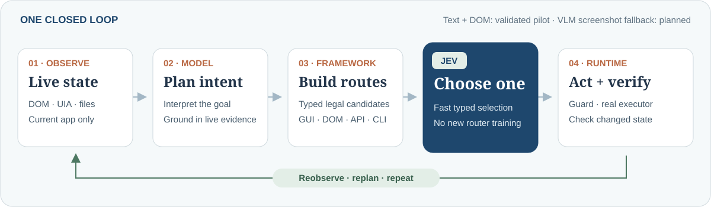

#  CUA-JEV: Jev for Computer Use

[Webpage](https://zjureal.com/CUA-JEV/) · [中文文档](README.zh-CN.md)

CUA-JEV is an open-source reference framework for Jev-powered computer use. A task adapter turns structured state from the browser, desktop UI, office applications, terminal, or filesystem into **legal, executable, verifiable** action candidates. [Jev](https://docs.typesafe.ai/introduction) selects a **concrete action and its execution route**; the framework guards and executes that choice, verifies the resulting state, and observes again. The project includes four earlier task-specific workflows and four newer recorded model + Jev Windows case studies, without training a task-specific router.

Jev's fast, typed decisions are a promising fit for downstream systems that must choose actions repeatedly under latency constraints, including computer use, embodied agents, and potentially autonomous driving. [RoboJEV](https://github.com/lykycy123/RoboJEV) already explores the embodied setting with Jev-controlled manipulation in a MuJoCo simulator. CUA-JEV explores a different setting: choosing both *what to do next* and *which computer-use channel should do it*.

> **Scope:** The earlier four application workflows use task-specific adapters. The newer model + Jev cases discover live pages and actions, but remain bounded to one browser origin, registered tools, and a scoped artifact. Neither set establishes reliable operation on arbitrary applications or tasks. Jev selects among constrained options; it does not generate arbitrary scripts or interpret screenshots itself.

**Platform status:** The typed decision loop, guards, and traces are designed to be portable, and CI is configured to run unit tests on Linux and macOS as well as Windows. The experimental Playwright browser path can be configured to use bundled Chromium; its macOS behavior still needs a live run. The published desktop workflows and `open-desktop` depend on Windows integrations such as UI Automation, Excel COM, and Explorer. macOS/Linux **desktop** adapters have not been implemented or validated.

The [experimental open-task paths](docs/OPEN_TASKS.md) separate model planning from Jev's typed action selection. They discover browser DOM elements or Windows UI Automation controls dynamically and offer grounded structured-tool / physical-GUI alternatives without a site- or app-specific click sequence. Four roughly twenty-action browser-to-tool cases now run end to end with a model and Jev, but **arbitrary-task generalization is not claimed**.


## Recorded Windows case studies

The [new homepage](https://zjureal.com/CUA-JEV/) shows four **real, window-only** model + Jev runs. A text model reads live DOM and registered tool descriptions, proposes grounded next actions, and Jev selects one concrete action and channel at every step. A same-origin MCP reader supplies source evidence; scoped CLI and file capabilities complete the cross-app handoff. No chapter URL or click sequence is prewritten. Each run also has an expandable step trace and an action-channel breakdown on the site.

| Case | Task applications | Actions / Jev calls / model calls | Selected channels |
|---|---|---:|---|
| Python automation guide | Edge, Terminal, VS Code | 19 / 19 / 19 | DOM 8, MCP 8, CLI 2, file API 1 |
| JavaScript study guide | Edge, Notepad | 18 / 18 / 18 | DOM 8, MCP 8, CLI 1, file API 1 |
| Git workflow guide | Edge, Terminal, VS Code | 21 / 21 / 21 | DOM 10, MCP 8, CLI 2, file API 1 |
| PowerShell learning guide | Edge, Terminal, Notepad | 19 / 19 / 19 | DOM 8, MCP 8, CLI 2, file API 1 |

These are **single successful bounded research-to-editor runs**, not repeated success-rate, speed, or cost benchmarks. They used structured observations and a text planner; **VLM calls were zero**. GUI routes were available for browser links but Jev selected DOM in these recordings. Vision, broader desktop action coverage, unfamiliar task families, macOS, and repeated trials remain future work. The earlier predefined workflows and their paired comparisons live on the site's [Early work page](https://zjureal.com/CUA-JEV/early-work.html).

## Why Jev × computer use?

TypeSafe AI describes Jev as a *System One* decision model for software: given state and a typed question, it returns a structured answer suitable for an application branch. Its [Choice primitive](https://docs.typesafe.ai/introduction) fits the question “which of these known actions should we take?” better than generating prose and parsing it into a tool call. TypeSafe calls its training approach RLCD; **CUA-JEV uses the existing Jev API and does not train Jev or a new CUA model**. See the [TypeSafe overview](https://typesafe.ai/) and [developer documentation](https://docs.typesafe.ai/introduction).

Computer use naturally has a hybrid action space. A subgoal may be best served by visible mouse-and-keyboard work, or by DOM, COM, CLI, MCP, or a file API. Replanning, generating commands, and parsing output with a general-purpose model at every step can add latency and model cost; a fixed router, meanwhile, may miss useful alternative routes. We narrow the open-ended planning problem to **constrained action selection**: task adapters propose real actions, Jev chooses one online, and deterministic code handles safety and factual verification.

This division of labor depends on informative structured observations and well-engineered candidates and verifiers. Jev does not replace missing perception, task decomposition, or software integration.

## How it works

1. **Observe / Generate:** A task adapter reads application state and enumerates only currently legal `intent × channel` candidates. For example, repairing a failing test can offer real VS Code GUI, MCP, restricted CLI, and file API routes.
2. **Select with Jev:** The Jev `choice` API selects a candidate ID. The chosen action and its arguments are already typed and defined; Jev does not execute arbitrary shell text.
3. **Guard / Execute:** `ActionGuard` checks observation freshness, candidate identity, path scope, write permissions, and confirmation requirements before dispatching to a registered executor.
4. **Verify / Repeat:** An executor receipt is not proof of success. An independent verifier checks the new application state; a JSONL trace records the choice, execution, timing, and evidence. The loop observes again until the terminal task condition holds.

The reusable pieces are [`ActionCandidate`](src/cua_jev/models.py), [`AgentRuntime`](src/cua_jev/runtime.py), [`ActionGuard`](src/cua_jev/guard.py), [`ExecutorRegistry`](src/cua_jev/registry.py), observer and capability interfaces, and the evaluation/trace contract. The four workflows are reference implementations of these interfaces.

### Earlier task-specific workflows

| Application | Goal | Competing channels in this release |
|---|---|---|
| Edge | Sign in to a public demo store, sort items, build a cart, check out, and verify the receipt | PyAutoGUI, DOM |
| Excel | Compute metrics, mark review status, create charts, and verify the workbook in a separate COM session | PyAutoGUI, COM |
| VS Code | Diagnose and repair multiple defects while repeatedly running tests | PyAutoGUI, MCP, CLI, file API |
| Explorer | Select reports from a mixed inbox and produce verifiable release artifacts | PyAutoGUI, MCP, CLI, file API |

In **GUI Only**, structured interfaces may still provide observations and element locations, but mutations use PyAutoGUI. In **Hybrid**, Jev can select among the available GUI and structured execution routes. A keyless Rule policy is also included for testing and ablations. Windows UI Automation, terminal text, and filesystem state can serve as observation channels.

## Early experiments and demos

The [Early work page](https://zjureal.com/CUA-JEV/early-work.html) contains four workflow videos, two separate comparisons, and expandable execution records:

- **Jev Hybrid vs Jev GUI Only:** Same Jev policy and terminal verifier; different action spaces. The comparison focuses on completion time.
- **Jev Hybrid vs Codex Computer Use Hybrid:** Both may use mixed tools. The pilot compares measured wall time and estimated model cost in US dollars.

Initial v2 records from 2026-09-23 are shown below in seconds. Jev values are medians of available successful runs; Codex has one pilot run per workflow.

| Workflow | Jev Hybrid | Jev GUI Only | Codex Hybrid |
|---|---:|---:|---:|
| Edge | 79.5 | 87.4 | 77.4 |
| Excel | 84.2 | 83.2 | 39.2 |
| VS Code | 14.0 | 90.8 | 57.9 |
| Explorer | 13.2 | 211.1 | 50.9 |

VS Code and Explorer illustrate how structured routes can avoid long sequences of GUI actions. **In these Edge and Excel Hybrid runs, however, Jev still chose GUI routes; Excel was slightly slower than GUI Only.** These results do not show that Jev is faster on every task. Codex is a general-purpose tool agent, while Jev uses prebuilt task capability packs; the samples are too small for a general performance ranking. The dollar figures on the website are **model-cost estimates, not billed charges**, derived from [TypeSafe public pricing](https://docs.typesafe.ai/models) and the [OpenAI public rate card](https://help.openai.com/en/articles/20001415-chatgpt-rate-card-enterprise-token-based-pricing). The minimal token accounting and caveats are kept with the published [`website/snapshot.json`](website/snapshot.json), rather than in separate process files.

The public site is a read-only experimental snapshot. It neither calls the Jev API nor runs tasks on a visitor's computer. Video durations are not the benchmark wall times. Jev step lists come from representative run traces; Codex entries summarize recorded tool calls by phase and are not presented as equivalent atomic GUI steps. The curated publication data lives in [`website/snapshot.json`](website/snapshot.json).

## Open-task pilot

An open goal requires two different kinds of decisions. A general model can interpret unfamiliar state and propose *grounded next actions*; Jev can quickly choose among already-typed, legal action-and-route candidates. The framework sits between them: it reads live DOM/UI Automation/file state and optionally bounded VLM scene text, validates the proposal against that observation, expands it into executable GUI/DOM/API/CLI candidates, guards the selected action, and checks the resulting state before repeating. Jev does **not** interpret screenshots or generate shell commands. The optional screenshot/VLM path is integrated into `open-browser` and `open-desktop`, but was **not used in the recorded 12-decision cross-app case**.



The [twelve-decision cross-app recording](https://zjureal.com/CUA-JEV/early-work.html#open-task) starts at the official Python tutorial index. Given five requested chapter headings—but **no chapter URLs, selectors, or click sequence**—the text model follows live links, extracts one exact quote from each of five distinct chapter pages, synthesizes a sourced study guide, writes a new Markdown file, and opens it in VS Code. Jev selects every step from the current typed candidates: **5 DOM navigations in Edge → 5 internal evidence records → 1 file API write → 1 CLI launch of VS Code**. The evidence records update framework state; they are not external computer-use actions. Research-topic headings and the new output path are user-supplied acceptance constraints; this remains a bounded browser-to-editor task family.

The [independent research verifier](scripts/verify_research_demo.py) reopens the five cited official pages in a fresh browser, checks their headings and exact quotations, confirms the written file, and checks that every decision came from Jev. It checks provenance and execution, **not** whether the model wrote the best possible teaching material. The recorded `dashscope/qwen3.5-plus` run made 12 model plans and 12 Jev decisions in **155.9 s**; the public video is uniformly sped up 2.5× for viewing. A separate successful `DeepSeek-V4-Flash` run took **307 s**, including **287 s** in planner requests. Failed attempts also occurred due to gateway timeouts and malformed plans. These are case studies, **not** a repeated success-rate, latency, or cost benchmark; an end-to-end speed advantage for open-task mode has not been established.

To reproduce this task family on Windows, use an existing HTTPS model gateway (or explicitly opt in to trusted local-network HTTP), a new `.md` output path, and a private model key. The command never overwrites an existing note:

```powershell
$env:CUA_JEV_MODEL_API_KEY = "..."  # keep local; do not commit
cua-jev open-workspace --goal "Study the first five official Python tutorial chapters, cite one exact quote from each, and open a sourced guide in VS Code" `
  --url "https://docs.python.org/3/tutorial/" --note "artifacts/open-workspace/my-guide.md" `
  --model-base-url "https://YOUR_MODEL_GATEWAY/v1" --model "YOUR_MODEL_ID" `
  --research-topic "Whetting Your Appetite" `
  --research-topic "Using the Python Interpreter" `
  --research-topic "An Informal Introduction to Python" `
  --research-topic "More Control Flow Tools" `
  --research-topic "Data Structures" --max-steps 20 --policy jev
```

For a recording, use [`scripts/record_open_workspace.py`](scripts/record_open_workspace.py); it captures only the real task window after Edge is visible. That pilot remains a **browser-to-editor task family** with one allowed web origin and one scoped output file; it does not use a VLM. A separate experimental cross-app loop is described below. See [open-task details and limitations](docs/OPEN_TASKS.md).

### Scoped browser + local-tool pilot (experimental)

`open-browser` can also opt into a **read-only local capability pack**. The text model sees temporary `tN` references alongside live browser `eN`/`vN` references; Jev selects one concrete browser or local-tool action. The runtime, not the model, fixes the executable operation and path. Current offers are scoped directory listing, small top-level `.md`/`.txt` reads, registered `python --version`, and Git status when the scoped directory is a repository. There is no arbitrary shell command, model-chosen path, or file write in this path. `--require-tool` and `--require-url-contains` supply independent acceptance gates for a bounded cross-tool goal.

In one **real, unrecorded pilot**, the goal was to check local Python through CLI and open a different official Python tutorial chapter. The model proposed both a CLI and DOM action; Jev selected `cli.python_version` with **0.99** probability, then a DOM link. Both actions verified; the required tool and URL checks passed in **7.0 s** (two planner calls, two Jev decisions). This is a single integration result, not a held-out success rate or a cross-model benchmark. VLM was disabled in this run; the earlier DOM+VLM pilot is separate.

A second two-step run enabled the VLM on the same kind of browser + CLI goal. It also completed, but took **51.4 s**, with **45.1 s** in visual requests: one VLM response failed validation and fell back to DOM, while the other produced a valid scene. This is evidence of fallback behavior and a current latency/reliability bottleneck, **not** evidence that adding vision improves performance.

```powershell
cua-jev open-browser --goal "Check local Python version and open More Control Flow Tools" `
  --url "https://docs.python.org/3/tutorial/index.html" `
  --model-base-url "https://YOUR_MODEL_GATEWAY/v1" --model "YOUR_TEXT_MODEL" `
  --local-tool-root "PATH_TO_A_CONTROLLED_DIRECTORY" `
  --require-tool cli.python_version --require-url-contains "/3/tutorial/controlflow.html" `
  --policy jev
```

Only opt into a directory whose filenames and text you are willing to send to the planner; private traces can also contain tool results. Local results are withheld from the Jev request. This is a **bounded cross-tool path inside one browser origin**, not arbitrary cross-app support. See [open-task details](docs/OPEN_TASKS.md).

### One browser + one desktop window (experimental)

`open-computer` composes a live browser observer, an **optional explicitly selected Windows UI Automation window**, and registered local/MCP tools in one planning/decision loop. Browser, desktop, and tool refs are namespaced (`b:`, `d:`, `t:`, `m:`); the model proposes grounded options, the adapters compile their real DOM/UIA/GUI/CLI/MCP/API routes, and Jev chooses the concrete action. Caller-supplied URL, window-state, and executed-capability gates determine success; model claims alone do not. App-window actions require an explicit opt-in, and common English/Chinese system Close/Minimize/Maximize labels are filtered (not a universal safety classifier).

One real, unrecorded pilot used official Python documentation, the installed Python CLI, and Windows Calculator. Jev made **three decisions**: CLI version → browser DOM navigation → Calculator UIA click on “七”; the live URL and Calculator display “7” passed independent checks in **8.5 s**. At the middle decision, Jev assigned **0.90 DOM / 0.09 UIA / 0.01 GUI**; at the final decision, **0.90 UIA / 0.10 GUI**. An earlier attempt stopped safely after two actions because the model's UIA operation was not accepted; an explicit `invoke`→typed `click` normalization for a live invokable control was then tested before the successful retry.

A separate run enabled **Calculator-window VLM scene grounding** in the same three-action task. All three screenshot interpretations were valid; the task passed in **48.5 s**, including **28.2 s** of VLM requests and **14.2 s** of planner requests. The planner still chose the structured “七” control, and Jev selected UIA over GUI (0.89 vs 0.11); no visual-coordinate click was selected. These are integration runs, **not** a paired speed or success-rate benchmark, and they do not show that vision improved the task.

The host now talks to typed [action-surface providers](src/cua_jev/surface_providers.py) through `observe → validate → compile → execute → verify`. The browser, Windows UIA window, and scoped tools implement this contract; a test replaces the Windows desktop provider without changing the planner or Jev/runtime loop. A compact model-facing snapshot preserves live refs and labels while omitting runtime handles and geometry; the full snapshot remains available for freshness and execution checks. In a second live CLI → DOM → UIA task (Python version, a different documentation chapter, and Calculator “8”), all caller-supplied gates passed in **15.4 s** over three Jev decisions. The text planner reported **15,930 tokens** across three calls. This one run is a regression smoke test, **not** evidence of cost or speed improvement.

An optional [MCP tool surface](src/cua_jev/mcp_surface.py) adds explicitly registered `m:` offers alongside DOM, UIA, and local tools. A trusted local profile fixes the stdio executable, tool allowlist, and base arguments; the model may select a live ref and fill only caller-declared, strictly bounded primitive parameters. It cannot generate a command or change fixed arguments. MCP calls are disabled without `--mcp-profile` **and** `--allow-mcp-actions`, and are treated as potentially side-effecting. A real MCP file read passes an end-to-end test alongside browser DOM and desktop UIA actions; a separate protocol test exercises an unseen, schema-bounded parameter. This tests integration, not the safety or usefulness of arbitrary third-party MCP servers; see the [profile format and limits](docs/OPEN_TASKS.md#registered-mcp-calls).

A second, simulated editor-style cross-app goal exercises UIA text fill plus browser navigation. Its terminal gate re-reads the edit control's live value without exposing that observed value in the model-facing desktop snapshot. It is **not** a live Notepad result.

The host is [open_computer.py](src/cua_jev/open_computer.py). Its desktop window is now optional: browser + registered CLI/MCP tools run through the same loop without importing a Windows UIA window, and a real MCP-protocol integration test covers this mode. Select Playwright Chromium for the portable browser path. The shipped desktop provider is still **Windows UIA-only**; neither the no-window mode nor the replacement-provider test establishes a successful macOS run. It remains limited to one browser origin, at most one selected window, and registered tools—not an arbitrary-application agent.

For longer goals, the same host accepts caller-supplied page-visit gates and a **create-only cited text artifact**. A same-origin MCP reader can be constrained to the current page, once per page. After fixing transient-DOM recovery and switching to an available campus model, an eight-chapter **live 18-action run** completed in 251.4 s; a visible Edge recording repeated the 18 actions in 240.7 s (8 DOM, 8 MCP, 1 CLI, 1 file API). This is a bounded task with eight caller-specified chapter clues, not a generality result. A separate deterministic 20-action regression uses a simulated browser and scripted planner. Raw videos and traces stay local; neither result is a speed or cost benchmark.

The next experimental mode removes the page-URL list: `--min-verified-sources N` asks the model to discover distinct non-start pages from live links, while the framework requires a verified current-page MCP read and citations before writing. Optional `--require-source-title-contains` values express topical acceptance **without prescribing URLs or clicks**; late relevant DOM links are prioritized over an arbitrary first-60 cutoff. An opt-in `--open-artifact-vscode` action opens the exact new file and verifies a newly created VS Code window rather than a stale same-name window. One live four-topic Edge → VS Code case completed **12 actions / 173.8 s** (5 DOM, 4 MCP, 2 CLI, 1 file API); its guide and video were reviewed locally. An earlier unconstrained take passed structural checks but misattributed an error-handling paragraph, and another exhausted its 18-step budget while searching for required topics. These failures show why source count alone is not semantic verification. This mode still requires a trusted MCP profile, one browser origin, caller-supplied acceptance criteria, and a scoped file; it is **not arbitrary-task support or a reliability study**. See [open-task notes](docs/OPEN_TASKS.md).

### Browser DOM + VLM + Jev pilot (experimental)

`open-browser` can now fuse live DOM controls with an opt-in VLM description of the current viewport. The text model proposes grounded DOM or visual refs; the framework validates each one and can offer both DOM click and screenshot-grounded browser-mouse routes for the same visible control. Jev chooses one concrete candidate. Visual clicks require explicit screenshot-upload, visual-click, and external-action opt-ins; they are checked against the current URL, DOM, viewport geometry, and screenshot freshness before execution. DOM/visual changes check **effect**, while a live URL/title/text condition checks the bounded goal. This is not unrestricted web automation.

One real public Python-documentation run completed a **single-step** chapter navigation in 9.8 s: the VLM returned scene text, the planner proposed DOM and visual options, and Jev chose DOM with probabilities **0.99 vs 0.01**. The VLM took 4.7 s, the planner 1.9 s, and Jev 0.66 s. Earlier attempts failed on malformed VLM output and a malformed plan; these are **pilot observations, not a success-rate or speed benchmark**. The older 12-decision video remains text + DOM.

```powershell
python -m pip install -e ".[browser-vision]"
python -m playwright install chromium
cua-jev open-browser --goal "Open a chapter" --url "https://docs.python.org/3/tutorial/index.html" `
  --browser-channel chromium --model-base-url "https://YOUR_MODEL_GATEWAY/v1" `
  --model "YOUR_TEXT_MODEL" --vision-model "YOUR_VISION_MODEL" --vision-mode always `
  --allow-screenshot-upload --policy jev
```

Add `--allow-visual-clicks --allow-external-actions` only for a controlled test where visual mouse actions are authorized. The model gateway is contacted directly by default, bypassing environment proxies.

### Optional window-screenshot/VLM path (experimental)

`open-desktop` can capture **one explicitly selected Windows window** and send its resized JPEG to a separately chosen vision-capable model. The VLM returns a bounded scene summary, short visible-text excerpts, and normalized target boxes—not code or commands. This textual scene is fused with live UI Automation controls for the slow planner. The framework validates target boxes, offers UIA/API or physical-GUI candidates where available, and Jev selects a concrete candidate from the current legal set. Jev receives text, not pixels; verbatim OCR lines are withheld from its request. Before visual clicking, the runtime checks window geometry and screenshot freshness; after clicking, it checks live UIA or pixel change. UIA-derived completion checks remain required—an image change alone is **not proof of task completion**. `fallback` calls the VLM when UIA exposes no actionable controls; `always` fuses both on every observation.

Screenshot upload and visual clicks are explicit opt-ins. Use a controlled, non-sensitive window: the image may contain private screen content, and `--allow-button-actions` broadly authorizes clicks in that window. A **synthetic-image** direct campus-gateway probe of `dashscope/qwen3-vl-32b-instruct` returned a valid scene and Save-button box in 7.9 s (351 reported tokens); mocked end-to-end window tests pass. This does **not** establish a completed live VLM + Jev task, arbitrary-task support, or macOS support. The published 12-decision video remains text + DOM, not vision.

```powershell
cua-jev open-desktop --goal "Complete a controlled window task" --window-title "^Your Test Window$" `
  --model-base-url "https://YOUR_MODEL_GATEWAY/v1" --model "YOUR_TEXT_MODEL" `
  --vision-model "YOUR_VISION_MODEL" --vision-mode fallback `
  --allow-screenshot-upload --allow-visual-clicks --allow-button-actions --policy jev
```

## Quick start

You need Windows and Python 3.11+. Try the keyless Rule baseline first:

```powershell
py -m venv .venv
.\.venv\Scripts\Activate.ps1
python -m pip install -e ".[dev,all,ui]"
playwright install chromium
cua-jev doctor
cua-jev demo --policy rule
cua-jev suite --task vscode --policy rule --profile adaptive --open-vscode
```

To use Jev, put your API key in the local, Git-ignored `.env` file. **Never commit the key.**

```powershell
Copy-Item .env.example .env
# Set TYPESAFE_API_KEY=... in .env
cua-jev jev-smoke
cua-jev suite --task vscode --policy jev --profile adaptive --open-vscode
```

Use `--task edge|excel|vscode|explorer|all` to choose a workflow. `--profile adaptive` means Hybrid; `--profile visible` means GUI Only. Add `--headed-edge` for visible Edge, or `--visible-apps` for Excel/Explorer. The public store example uses a [SauceDemo](https://www.saucedemo.com/) test account and a demo order, with no real payment.

To run the local, read-only showcase:

```powershell
cua-jev-ui
# http://127.0.0.1:8768
```

To repeat paired runs and recordings:

```powershell
python -m pip install -e ".[all,ui,recording]"
python scripts/record_v2_demos.py --task all --profile both --policy jev
```

Local records are written to ignored `runs/`; raw recordings go to ignored `artifacts/demos/`. The public site uses only reviewed copies in `website/media/`. CI can run unit tests on Linux, but the four desktop workflows require Windows.

## Extend with another task

1. **Define state and success:** Implement an observer that produces compact, stable, verifiable structured state. See [`observers.py`](src/cua_jev/observers.py) and [`suites.py`](src/cua_jev/suites.py).
2. **Enumerate real alternatives:** Build an [`ActionCandidate`](src/cua_jev/models.py) for every currently legal `intent × channel`, including a stable ID, capability, arguments, risk level, and verifier. Do not inflate the candidate set with actions that cannot execute.
3. **Register capabilities and executors:** Use [`capabilities.py`](src/cua_jev/capabilities.py) and [`registry.py`](src/cua_jev/registry.py) as guides for mapping GUI/DOM/COM/CLI/MCP/API routes to actual tools. CLI actions use registered argv templates, not arbitrary `shell=True` commands.
4. **Verify and reset independently:** Assert the resulting state, define terminal success, and make the fixture repeatable. Test failed, repeated, and rejected actions. See [`verify.py`](src/cua_jev/verify.py) and [`tests/`](tests/).
5. **Evaluate before publishing:** Run Hybrid and GUI Only, recording success rate, wall time, decision time, action mix, fallback, and guard rejection—not only the best run.

The minimal JSON task in [`inspect_report.json`](src/cua_jev/predefined/inspect_report.json) introduces the candidate contract. A real new application also needs dynamic observation, executors, and terminal verification.

## Roadmap

- [x] Jev `choice`, typed candidates, shared runtime, guard, receipts, and JSONL traces.
- [x] GUI / DOM / COM / CLI / MCP / API execution interfaces and a keyless Rule baseline.
- [x] Four Windows-validated desktop workflows, independent terminal verification, Hybrid / GUI Only paired experiments, and a Codex Hybrid pilot.
- [x] Read-only website, curated experimental snapshot, real videos, and expandable execution steps.
- [x] Experimental model + Jev browser-to-VS-Code task family with a five-source, 12-action case, window-only recording, and separate source-grounding check.
- [ ] Evaluate unseen goals and sites with repeated trials, failure analysis, confidence intervals, and measured end-to-end latency and dollar cost. A completed case is not a benchmark.
- [ ] Generalize task adapters across software and tasks, then explore macOS / Linux and more browser and office applications.
- [x] Add opt-in, window-only screenshot/VLM target grounding to the experimental desktop path, while retaining the text-only path; offline integration tests pass.
- [x] Fuse bounded VLM scene text with UI Automation for grounded planning; validate a synthetic image against the campus VLM gateway and add trace-level decision/channel analysis.
- [x] Fuse DOM and viewport vision in the open-browser path, add grounded visual-mouse alternatives, and complete a real single-step VLM + text model + Jev browser pilot (with failed attempts recorded).
- [x] Add an opt-in scoped read-only local capability pack to open-browser and complete one real browser + CLI goal with independent tool/URL acceptance gates.
- [x] Compose browser DOM, one selected Windows UIA window, and scoped CLI/API tools in a bounded open-computer loop; complete one real three-channel task with caller-supplied terminal gates.
- [x] Extract an action-surface provider contract, test a replacement accessibility backend, compact model-facing state, and rerun a distinct live CLI → DOM → UIA goal.
- [x] Add opt-in, profile-bound MCP calls to the combined action space and test a real MCP stdio call in the same episode as DOM and UIA.
- [x] Remove the mandatory Windows-window dependency for browser + registered-tool tasks; test the no-desktop loop and bounded model-generated MCP parameters.
- [x] Add caller-defined source-visit and cited-artifact gates, a scoped same-origin MCP reader, per-page read controls, and a deterministic 20-action cross-channel regression.
- [x] Complete and locally record an 18-action live bounded case; add model-discovered sources, topical source gates, late-link prioritization, and verified Edge → VS Code artifact handoff in a distinct 12-action live case.
- [x] Record four verified 18–21-action Windows model + Jev case studies, derive Jev/model counts and action mix from private traces, and publish reviewed window-only videos separately from earlier predefined tasks.
- [ ] Run repeated held-out tasks and task families with independently verified artifact quality, failure taxonomy, action mix, wall time, token use, and dollar cost; include successful GUI/VLM choices rather than only offering those routes.
- [x] Add a distinct editor-style cross-app regression and keep observed edit values private while using them in freshness and terminal checks.
- [x] Complete one live cross-app VLM-scene-fusion run; the selected desktop action remained UIA, so visually grounded action selection is still unproven.
- [ ] Complete a live VLM-driven task and evaluate visual grounding, safety, success, latency, and cost on repeatable held-out desktop tasks.
- [ ] Extend the initial provider contract to macOS Accessibility, dynamic MCP, and additional apps; replace one-window/task-family constraints and validate unfamiliar cross-app tasks on both operating systems.
- [ ] Amortize or cache slow planner calls; divide work with general CUA / LLM models for unfamiliar intent and Jev for repeated constrained choices, optimizing success, latency, and cost together.
- [ ] Discover MCP tool schemas from trusted servers and verify the declared schema before offering calls; improve cross-channel recovery, per-action safety confirmations, and long-term regression benchmarks.

## Safety and license

`ActionGuard` fails closed on candidate identity, stale observations, allowed roots, writes, and external side effects. Excel does not run VBA; MCP can invoke only registered typed tools. A successful tool receipt still requires task-level verification. Model requests use HTTPS by default; HTTP requires explicit opt-in on a trusted network. Vision mode uploads the selected window image only with explicit consent; screenshot bytes and API keys are not written to traces, site snapshots, or the Git repository.

The code is released under [Apache-2.0](LICENSE). The ZJU-REAL mark identifies the lab project and does not change ownership of third-party branding; app icon sources are listed in [`ATTRIBUTION.md`](src/cua_jev/ui/static/icons/ATTRIBUTION.md).

## Acknowledgements

We thank [TypeSafe AI](https://typesafe.ai/) for developing Jev and providing the API and documentation that make this integration possible. We also acknowledge the authors of [RoboJEV](https://github.com/lykycy123/RoboJEV) for their open embodied-agent demonstration, which helped motivate exploring Jev in another action-rich domain. CUA-JEV is an independent research and engineering project, not an official TypeSafe AI or RoboJEV product.
