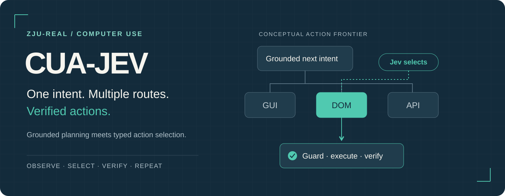
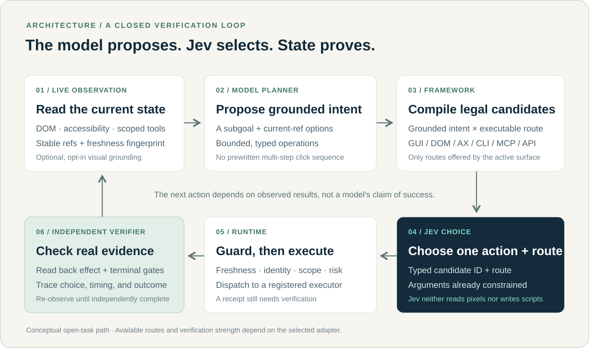
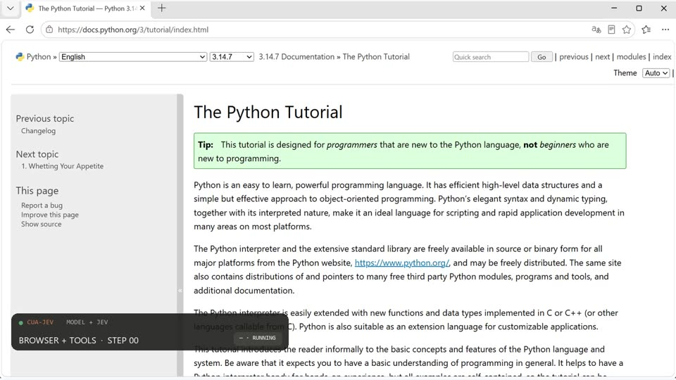
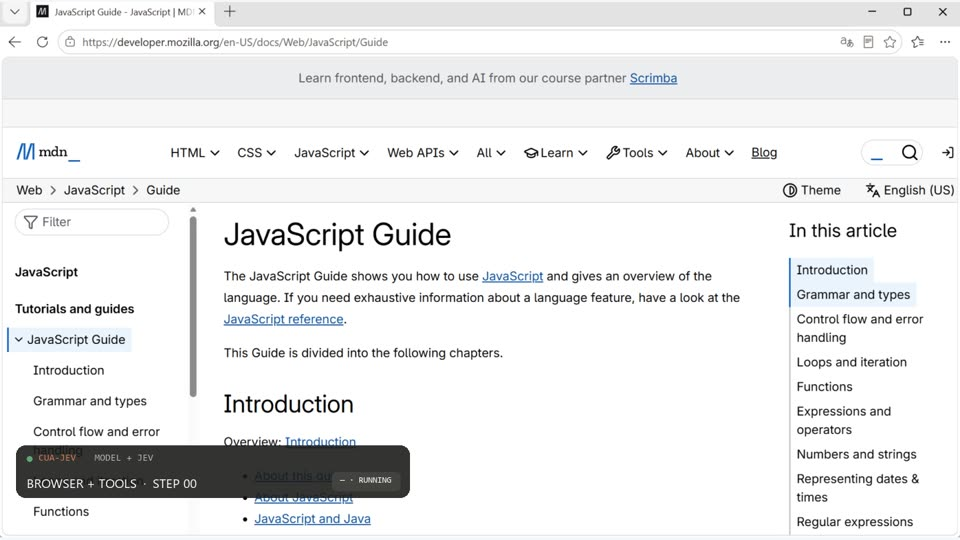
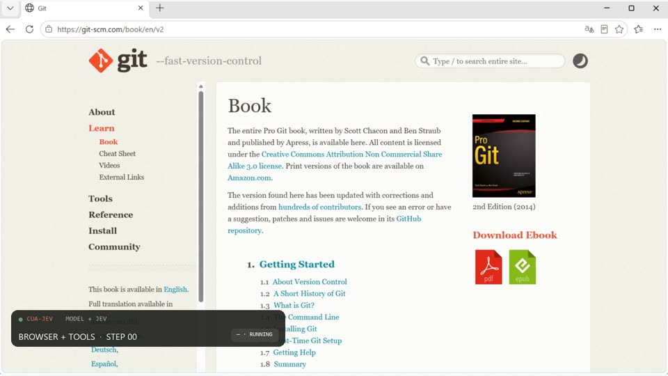
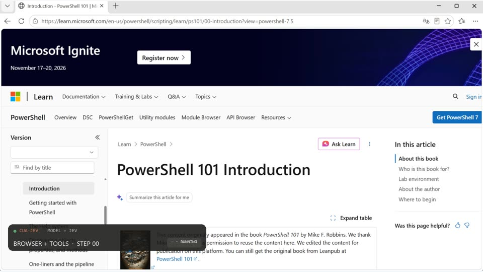

# CUA-JEV

[](https://zjureal.com/CUA-JEV/)

**A reference framework for grounded planning, typed action selection, and independently verified computer use.**

[Webpage](https://zjureal.com/CUA-JEV/) · [Watch real runs](https://zjureal.com/CUA-JEV/#windows-cases) · [中文](README.zh-CN.md) · [macOS guide](docs/MACOS.md) · [Open-task guide](docs/OPEN_TASKS.md)

A general model proposes grounded next intents from live application state. The framework turns those proposals into legal **intent × execution-route** candidates. **Jev chooses one concrete action and its route**; the runtime guards it, executes it, and checks the result against real state before deciding again.

The same intent may have a GUI, DOM, accessibility, CLI, MCP, or file-API route, depending on the active surface. Jev chooses among those typed alternatives. It does not read screenshots, generate arbitrary scripts, or replace task verification. CUA-JEV uses the existing Jev API; it does not train a new model.

> **Evidence, not a generality claim.** The public showcase contains four successful, bounded Windows model + Jev runs. On macOS, live model + Rule checks cover browser, CLI, and native AX actions; separate deterministic checks cover AX and GUI, with single-window recording validated. Mac model + Jev runs remain pending. These single-run checks do not establish arbitrary-task reliability or a speed/cost advantage.

## How the loop works



| Layer | Responsibility |
|---|---|
| Observation | Read live DOM, accessibility, and scoped tool state; attach references and a freshness fingerprint. |
| Model planner | Propose bounded operations on currently observed references. Optional vision provides separate grounding. |
| Action surfaces | Validate the proposal and compile only routes that the selected backend can execute. |
| Jev | Select a concrete typed candidate, including the action and channel. |
| Runtime | Check identity, freshness, scope, and risk; dispatch through a registered executor. |
| Verification | Read back effects and caller-defined terminal gates; record evidence, timing, and usage locally. |

The model's success claim and an executor's successful return are both insufficient on their own. Verification is independent, but its strength depends on the chosen gates: checking citations and file integrity does not prove the quality of every sentence.

## Recorded Windows cases

Four **real, window-only recordings** follow live documentation links, read sources through a same-origin MCP tool, create a cited guide, and open the exact artifact in an editor. The caller supplies the goal and bounded acceptance constraints; the model discovers the page sequence. No chapter URLs or click sequence are prewritten.

| Case | Applications | Actions / Jev / planner calls | Executed routes |
|---|---|---:|---|
| [Python automation](https://zjureal.com/CUA-JEV/#case-python-guide) | Edge → Terminal → VS Code | 19 / 19 / 19 | DOM 8 · MCP 8 · CLI 2 · API 1 |
| [JavaScript study](https://zjureal.com/CUA-JEV/#case-javascript-guide) | Edge → Notepad | 18 / 18 / 18 | DOM 8 · MCP 8 · CLI 1 · API 1 |
| [Git workflow](https://zjureal.com/CUA-JEV/#case-git-guide) | Edge → Terminal → VS Code | 21 / 21 / 21 | DOM 10 · MCP 8 · CLI 2 · API 1 |
| [PowerShell learning](https://zjureal.com/CUA-JEV/#case-powershell-guide) | Edge → Terminal → Notepad | 19 / 19 / 19 | DOM 8 · MCP 8 · CLI 2 · API 1 |

<details>
<summary>Preview all four recordings</summary>

| Python automation | JavaScript study |
|:---:|:---:|
| [](https://zjureal.com/CUA-JEV/#case-python-guide) | [](https://zjureal.com/CUA-JEV/#case-javascript-guide) |
| Git workflow | PowerShell learning |
| [](https://zjureal.com/CUA-JEV/#case-git-guide) | [](https://zjureal.com/CUA-JEV/#case-powershell-guide) |

</details>

These are single successful case studies, not repeated trials. **All four used text planning; VLM calls were zero.** Browser GUI routes were offered, but Jev selected DOM. The planner was called at every step, so these recordings do not demonstrate amortized planning. The website includes the full action traces and separates playback duration from measured wall time.

Earlier Edge, Excel, VS Code, and Explorer workflows used task-specific adapters. Their Hybrid / GUI Only comparisons, Codex pilot, and earlier open-task recording remain on the [Early work page](https://zjureal.com/CUA-JEV/early-work.html). See [experiment context](docs/EXPERIMENTS.md) for the evidence and limitations.

## Platform status

| Path | Implemented | Validated so far |
|---|---|---|
| Shared runtime | Typed candidates, guard, executors, traces, Rule and Jev policies | Portable unit/integration tests; CI matrix for Windows, Linux, macOS |
| Windows | UIA/GUI desktop, browser, registered tools, editor handoff | Four recorded model + Jev cases; earlier task-specific workflows |
| macOS browser + CLI | Chromium + scoped Python CLI | Real two-action Qwen3.8-Flash-Next + Rule smoke; keyless deterministic smoke also passes |
| macOS native | AX/CGEvent candidates, private edit readback, exact-document probes, single-window capture/recording | Four-action model + Rule smoke (DOM 1, CLI 1, AX 2); forced AX/GUI, single-window MP4, and separate TextEdit handoff checks pass. Model + Jev tasks pending |
| Linux desktop | No native desktop backend | Portable tests only; no published Linux desktop result |

The native Mac helper requires **macOS 14+ and Swift Command Line Tools**; native MP4 recording requires **macOS 15+**. The Mac results above are local fixture checks dated 2026-09-28, not a published long-form demo. See [MACOS.md](docs/MACOS.md) for modes, measured usage, and remaining validation.

## Start without API keys or desktop permissions

Python **3.11+** is required. These commands exercise a local sandbox with the deterministic Rule policy, not Jev or a model.

```sh
python3 -m venv .venv
source .venv/bin/activate
python -m pip install -e '.[dev,mcp]'
cua-jev doctor
cua-jev demo --policy rule
pytest -q
```

On Windows, create the environment with `py -m venv .venv` and activate it with `.\.venv\Scripts\Activate.ps1`; subsequent Python commands are the same.

On macOS, run a real local Chromium + CLI smoke without an external website:

```sh
python -m pip install -e '.[browser]'
python -m playwright install chromium
python scripts/macos_smoke.py --browser-only
```

To preview the public website from reviewed repository data:

```sh
python scripts/build_pages.py --build
python -m http.server 8768 --bind 127.0.0.1 --directory dist-pages
# Open http://127.0.0.1:8768
```

This static preview has no task-execution or API access. The optional `cua-jev-ui` console (`.[ui]`) also exposes local run-management endpoints; it is a separate development tool.

### When you are ready for model + Jev runs

Use [the macOS guide](docs/MACOS.md) for the native fixture, or [the open-task guide](docs/OPEN_TASKS.md) for browser, Windows desktop, registered MCP, and artifact workflows. Put credentials in a local, Git-ignored `.env`, using [.env.example](.env.example) as a template:

- `TYPESAFE_API_KEY`: Jev decisions.
- `CUA_JEV_MODEL_API_KEY`: the text/vision model gateway.
- `CUA_JEV_PLANNER_API_KEY`: only for the alternative provider-neutral planner endpoint.

Keep an existing `.env` when configuring additional keys. Never commit credentials or private task traces.

For the earlier Windows-only workflows, install `'.[all,ui,recording]'` and use `cua-jev suite --task edge --policy jev --profile adaptive`. Replace `edge` with `excel`, `vscode`, or `explorer` as needed. `adaptive` means Hybrid; `visible` means GUI Only. **Do not install the Windows `all` or `windows` extras on macOS/Linux.**

## Extend and evaluate

The main extension point is [`ActionSurface`](src/cua_jev/surface_providers.py): observe → validate → compile → execute → verify. Browser, accessibility, and registered-tool surfaces share one planning loop.

1. Define observable state and caller-controlled success conditions.
2. Compile real [`ActionCandidate`](src/cua_jev/models.py) alternatives with scoped arguments, risk, and verifiers.
3. Register executors; use fixed argv templates and trusted MCP profiles instead of arbitrary generated shell.
4. Verify effects and terminal conditions independently; test stale state, rejection, failure, and cleanup.
5. Evaluate repeated, held-out goals, including failures, channel choices, latency, model requests, tokens, and cost.

Useful entry points: [runtime](src/cua_jev/runtime.py), [episode lifecycle](src/cua_jev/episode.py), [guard](src/cua_jev/guard.py), [Mac surface](src/cua_jev/macos_surface.py), [trace analysis](src/cua_jev/trace_analysis.py), and [tests](tests/).

```sh
ruff check .
pytest -q -ra
python scripts/build_pages.py --build
```

Next priorities are Mac model + Jev tasks, live multi-window recording, robust cross-channel recovery, and repeated held-out evaluation. A roughly twenty-action Mac demo remains pending; the multi-window recording bundle has only offline test coverage. Mac VLM grounding and fewer planner calls remain future work.

## Data boundaries and license

Candidates are checked for freshness, identity, path scope, and allowed effects. Optional screenshot upload requires explicit opt-in. Local traces can contain page text, user-authored goals, tool results, or artifact content; keep `runs/`, `artifacts/`, and `.env` private. Public pages are built from reviewed [catalogs](website/windows_demos.json) and media, not raw local runs. Model-cost estimates in the early experiments are not billed charges.

Released under [Apache-2.0](LICENSE). App icon sources are listed in [ATTRIBUTION.md](src/cua_jev/ui/static/icons/ATTRIBUTION.md). We thank [TypeSafe AI](https://typesafe.ai/) for Jev and the authors of [RoboJEV](https://github.com/lykycy123/RoboJEV) for the embodied-agent demonstration that helped motivate this work. CUA-JEV is an independent ZJU-REAL research and engineering project.
