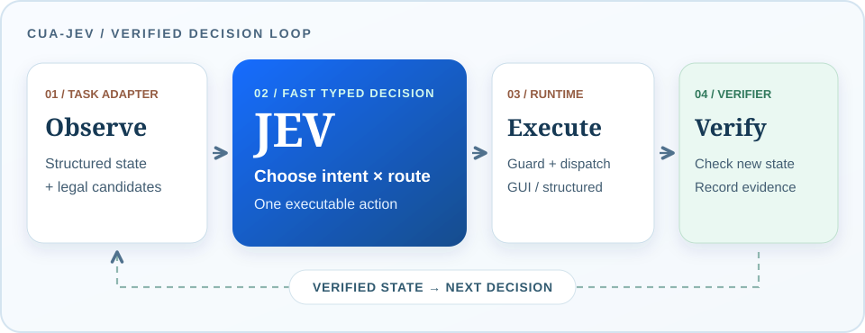

#  CUA-JEV: Jev for Computer Use

[项目网页](https://zjureal.com/CUA-JEV/) · [English README](README.md)

CUA-JEV 是一个面向 Windows Computer-Use Agent（CUA）的开源参考框架。它把 DOM、Windows UI Automation、Excel COM、终端和文件系统等结构化状态，转换为一组**当前合法、可执行、可验证**的候选动作；[Jev](https://docs.typesafe.ai/introduction) 从中选择一个 `任务意图 × 执行通道`，框架再负责安全检查、实际执行、结果验证和下一轮观察。首版不训练专用路由模型，也不依赖 VLM，提供四个完整可运行的任务范例及 Hybrid / GUI Only 对照实验。

Jev 的快速、类型化决策能力，适合探索需要高频、低延迟动作选择的下游方向，例如 CUA、具身智能，以及潜在的智能驾驶场景。[RoboJEV](https://github.com/lykycy123/RoboJEV) 已在 MuJoCo 仿真中探索 Jev 控制的机器人操作；CUA-JEV 则聚焦计算机使用中的“下一步做什么、通过哪种通道执行”。这是一项研究动机，不表示本框架已在机器人或智驾系统中得到验证。

> **能力边界：**这不是“给任意指令，就能操作任意 Windows 软件”的通用 Agent。目前四个案例都有任务专属适配器、候选动作与终态验证器。Jev 负责受约束的选择，不负责自由生成操作脚本，也不凭截图理解陌生软件。

现已增加[实验性的开放任务路径](docs/OPEN_TASKS.md)：低频模型规划器根据实时 DOM 或 Windows UI Automation 控件生成带引用的动作选项，Jev 再做类型化动作与执行通道选择。已实现 OpenAI 兼容协议适配器，但**本次校园网模型服务无法连通，因此尚未完成真实模型评测，也不能声称已支持任意任务**。



## 为什么是 Jev × CUA？

TypeSafe AI 将 Jev 定位为供软件直接调用的 *System One* 决策模型：输入状态和类型化问题，返回可直接用于分支的结构化答案。其 [Choice](https://docs.typesafe.ai/introduction) 原语尤其适合“从已知选项中选一个”，而不是生成一段文本再解析。TypeSafe 将模型训练方法称为 RLCD；**本项目调用现成 Jev API，并没有训练 Jev 或一个新的 CUA 模型**。[官方介绍](https://typesafe.ai/) · [开发文档](https://docs.typesafe.ai/introduction)

CUA 的动作空间天然是混合的。同一个子目标有时适合可见的鼠标键盘操作，有时更适合 DOM、COM、CLI、MCP 或文件 API。每一步都调用通用大模型重新规划、生成命令和解析输出，可能带来不必要的时间与推理费用；但固定规则也难以应对多种真实路线。我们的切入点是把**开放式规划问题收窄成受约束的动作选择问题**：适配器提供合法选项，Jev 在线选择，确定性代码负责安全与事实核验。

这个契合点也有前提：当前任务必须能提供有用的结构化观察，并且开发者需要实现可靠的候选动作和验证器。Jev 不能替代缺失的感知、任务分解或软件集成工程。

## 核心机制

1. **Observe / Generate**：任务适配器读取当前应用状态，只枚举此刻合法的 `intent × route` 候选。一个“修复失败测试”子目标可同时提供 VS Code GUI、MCP 写文件、受限 CLI、文件 API 等真实可行路线。
2. **Select with Jev**：调用 Jev 的 `choice` 接口，从候选 ID 中选出一个动作。选中的只是预定义的类型化动作及参数；Jev 不直接执行任意 shell 文本。
3. **Guard / Execute**：`ActionGuard` 检查观察版本、候选身份、路径边界、写入权限与确认要求，再分发到注册的执行器。
4. **Verify / Repeat**：执行回执不等于成功。独立验证器检查应用的新状态，JSONL trace 记录选择、执行、耗时和验证证据，然后重新观察，直到达到任务终态。

可复用的是 [`ActionCandidate`](src/cua_jev/models.py)、[`AgentRuntime`](src/cua_jev/runtime.py)、[`ActionGuard`](src/cua_jev/guard.py)、[`ExecutorRegistry`](src/cua_jev/registry.py)、观察器与能力包接口，以及评测/trace 契约；四个任务是这些接口的参考实现。

### 首版支持什么

| 任务范例 | 目标 | 首版可竞争通道 |
|---|---|---|
| Edge | 公开演示商店登录、排序、购物车、结账和收据核验 | PyAutoGUI、DOM |
| Excel | 计算指标、标记审核状态、生成图表并通过独立 COM 会话验证 | PyAutoGUI、COM |
| VS Code | 定位并逐一修复多个缺陷、反复运行测试 | PyAutoGUI、MCP、CLI、文件 API |
| Explorer | 从混合收件箱筛选报告并制作可验证的发布产物 | PyAutoGUI、MCP、CLI、文件 API |

GUI Only 中，状态读取与定位仍可使用结构化接口，但**修改操作通过 PyAutoGUI 完成**；Hybrid 则让 Jev 在真实可用的 GUI 与结构化执行路线中选择。项目同时提供无密钥的 Rule 策略，用于测试和策略消融。Windows UIA、终端文本、文件系统等也是适配器可用的观察通道。

## 实验与展示

[项目网页](https://zjureal.com/CUA-JEV/)提供四个案例视频、两组分开的比较，以及可展开的执行记录：

- **Jev Hybrid vs Jev GUI Only**：保持 Jev 策略与终态验证相同，比较动作空间对完成时间的影响。
- **Jev Hybrid vs Codex Computer Use Hybrid**：两者都允许混合工具，比较实测墙钟时间和基于公开费率的模型美元成本估算。

2026-09-23 的首批 v2 记录如下（秒；Jev 为已有成功记录的中位数，Codex 为每任务一次 pilot）：

| 案例 | Jev Hybrid | Jev GUI Only | Codex Hybrid |
|---|---:|---:|---:|
| Edge | 79.5 | 87.4 | 77.4 |
| Excel | 84.2 | 83.2 | 39.2 |
| VS Code | 14.0 | 90.8 | 57.9 |
| Explorer | 13.2 | 211.1 | 50.9 |

VS Code 和 Explorer 展示了混合通道避开大量 GUI 操作的潜力；**Edge 与 Excel 的这批 Hybrid 运行实际上仍选择了 GUI，Excel 甚至略慢**。因此不能把这四行描述为“Jev 在所有任务上更快”。Codex 是通用工具代理，Jev 则使用预先构建的任务能力包；样本数也不足以形成通用速度排名。网站展示的美元数值是按 [TypeSafe 公开价格](https://docs.typesafe.ai/models)和 [OpenAI 公开费率](https://help.openai.com/en/articles/20001415-chatgpt-rate-card-enterprise-token-based-pricing)折算的**模型成本估计，不是实际账单**。方法、token 计数与限制见 [`benchmarks/v2-cost-pilot-2026-09-23.json`](benchmarks/v2-cost-pilot-2026-09-23.json)。

网页是只读的公开实验快照，不连接 Jev API，也不运行用户电脑上的任务。案例视频是演示录制，表中耗时取自运行记录，而不是视频长度。Jev 展开的是代表性运行的逐步 trace；Codex 展开的是当时记录、按阶段合并的工具调用，不冒充一一对应的原子 GUI 动作。发布快照位于 [`website/snapshot.json`](website/snapshot.json)。

## 快速开始

需要 Windows 和 Python 3.11+。先体验不需要 Jev 密钥的 Rule 基线：

```powershell
py -m venv .venv
.\.venv\Scripts\Activate.ps1
python -m pip install -e ".[dev,all,ui]"
playwright install chromium
cua-jev doctor
cua-jev demo --policy rule
cua-jev suite --task vscode --policy rule --profile adaptive --open-vscode
```

调用 Jev 时，把密钥写入本机被 Git 忽略的 `.env`，**不要提交密钥**：

```powershell
Copy-Item .env.example .env
# 在 .env 中设置 TYPESAFE_API_KEY=...
cua-jev jev-smoke
cua-jev suite --task vscode --policy jev --profile adaptive --open-vscode
```

完整任务可用 `--task edge|excel|vscode|explorer|all`。`--profile adaptive` 是 Hybrid；`--profile visible` 为 GUI Only。Edge 可加 `--headed-edge`，Excel/Explorer 可加 `--visible-apps`。公开商店案例使用 [SauceDemo](https://www.saucedemo.com/) 测试账号与演示订单，不涉及真实付款。

本地只读展示页：

```powershell
cua-jev-ui
# http://127.0.0.1:8768
```

可重复的配对实验和录制：

```powershell
python -m pip install -e ".[all,ui,recording]"
python scripts/record_v2_demos.py --task all --profile both --policy jev
```

本地运行记录保存在被忽略的 `runs/`，原始视频保存在被忽略的 `artifacts/demos/`。公开网页只使用经过审核的 `website/media/` 副本。CI 可在 Linux 上执行单元测试，但四个真实桌面案例需要 Windows 环境。

## 扩展一个新任务

1. **定义任务状态与终态条件**：实现观察器，输出尽量简洁、稳定、可验证的结构化状态；参考 [`observers.py`](src/cua_jev/observers.py) 与 [`suites.py`](src/cua_jev/suites.py)。
2. **枚举真实候选动作**：为每个当前合法的 `意图 × 通道` 构建 [`ActionCandidate`](src/cua_jev/models.py)，提供稳定 ID、能力名、参数、风险级别与验证器。不要把不可执行的路线当作候选来“凑多样性”。
3. **注册能力与执行器**：参考 [`capabilities.py`](src/cua_jev/capabilities.py) 和 [`registry.py`](src/cua_jev/registry.py)，让 GUI/DOM/COM/CLI/MCP/API 等通道映射到真正的工具调用。CLI 只允许注册的 argv 模板，不使用任意 `shell=True` 命令。
4. **实现独立验证与复位**：验证实际状态变化，定义任务成功谓词和可重复的 reset；为失败、重复动作、拒绝执行等情况补测试。参考 [`verify.py`](src/cua_jev/verify.py) 与 [`tests/`](tests/)。
5. **评测再发布**：同时跑 Hybrid 与 GUI Only，记录成功率、墙钟时间、决策时间、动作通道分布、回退和拒绝；不要只展示最佳一次运行。

最小的 JSON 任务示例在 [`inspect_report.json`](src/cua_jev/predefined/inspect_report.json)。它适合学习候选动作契约；真正的应用扩展还需要动态观察、执行器和终态验证器。

## Roadmap

- [x] Jev `choice` 接入、类型化候选、统一运行时、guard、回执和 JSONL trace。
- [x] GUI / DOM / COM / CLI / MCP / API 多通道执行接口；无密钥 Rule 基线。
- [x] 四个 Windows 定义任务、独立终态验证、Hybrid / GUI Only 配对实验与 Codex Hybrid pilot。
- [x] 只读项目网页、脱敏实验快照、真实视频与可展开执行步骤。
- [ ] 从四个冻结案例扩展到参数化任务族、未见过的实例和足量重复试验；公布失败案例与置信区间。
- [ ] 把任务适配器做得更通用：跨软件、跨任务，逐步扩展到 macOS / Linux 与更多浏览器/办公应用。
- [ ] 增加可选的 VLM/视觉感知回退，用于 DOM、UIA、COM 不能可靠描述的界面；保持当前无 VLM 路径可用。
- [ ] 与通用 CUA / LLM 模型分工：让大模型处理开放式目标理解和新能力构建，让 Jev 承担可约束的高频选择，以任务成功率、延迟和成本共同优化路由。
- [ ] 完善跨通道失败恢复、动态 MCP 服务接入、安全确认与长期回归基准。

## 安全与许可

`ActionGuard` 对候选身份、过期观察、允许根目录、写入和外部副作用执行 fail-closed 检查。Excel 不运行 VBA；MCP 只能调用已注册的类型化工具。成功回执不是终态成功，必须由任务验证器确认。API 密钥只用于本地 HTTPS 请求，不写入 trace、网页快照或 Git 仓库。

代码以 [Apache-2.0](LICENSE) 发布。ZJU-REAL 标识用于表明实验室项目身份，不改变第三方品牌素材的权利归属；应用图标的来源见 [`ATTRIBUTION.md`](src/cua_jev/ui/static/icons/ATTRIBUTION.md)。

## 致谢

感谢 [TypeSafe AI](https://typesafe.ai/) 开发 Jev 并提供 API 与文档，使本项目的集成实验成为可能。也感谢 [RoboJEV](https://github.com/lykycy123/RoboJEV) 作者公开具身智能方向的 Jev 实践，启发我们进一步探索计算机使用这一多动作通道场景。CUA-JEV 是独立的研究与工程项目，并非 TypeSafe AI 或 RoboJEV 的官方产品。
